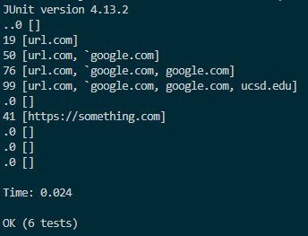

# Week 8 Lab Report 4
> Author: Jeffrey Li \
This page contains the additional tests in both my implementation of MarkdownParse and in the provided version.
___
## The MarkdownParse Repositories
[My version](https://github.com/jeffreyli640/markdown-parser) \
[Review Version](https://github.com/khiemddang/markdown-parser)
## Snippet 1
### Expected Output
`[url.com, google.com, google.com, ucsd.edu]`
### Implementation of Test

### Output in My Implementation
 \
**The test was able to pass for snippet 1.**
### Outpur in Review Implementation
 \
**In order to make the code output the correct result when inputing snippet 1, there had to be the deletion of some redudent codes in my code.** \
**The primary problem was that the code would reuslt in stack overflow error due to not having a correct break and return statement which makes the program run in an unending while loop.**
## Snippet 2
### Expected Output
`[b.com, a.com(()), example.com]`
### Implementation of Test

### Output in My Implementation
 
### Outpur in Review Implementation
 \
**A small change to the code should be able to fix the problem.** \
**Adding a line of code that detects multiple parens and brackets and then choosing the outer most one should be able to fix the output.**
## Snippet 3
### Expected Output
`[https://www.twitter.com, https://sites.google.com/eng.ucsd.edu/cse-15l-spring-2022/schedule, github.com, https://cse.ucsd.edu/]`
### Implementation of Test

### Output in My Implementation

### Outpur in Review Implementation
 \
**I don't think a small program change could make my code returns the correct output.** \
**The problem is that my code is not being able to seperate chunks to string from one another.** \
**A new method would have to be added that correctly distinguishes sections of string from one another.** 