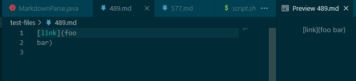

# Week 10 Lab Report 5
>Author: Jeffrey Li \
This Page contains the two selected test files that contained failure-inducing outputs.
___
## How the test-files were selected
**The two test files were selected using vimdiff and comparing between the results of my implementation of markdown-parser alongside the provided one.**
## The Test Files
[test-file-489](https://github.com/nidhidhamnani/markdown-parser/blob/main/test-files/489.md) \
[test-file-577](https://github.com/nidhidhamnani/markdown-parser/blob/main/test-files/577.md?plain=1)
## Test-file-489
**For 489.md, the provided implementations was correct. My implementation did not check the validity of the link while the provided version did.**
### Actual Output from My Implementation

### Actual Output from Provided Implementation

### Expected Output
**Since foo bar is not a link, there should be link returned.** \

### Bug Fix
**The problem in my implementation of MarkdownParse is that the code doesn't check whether or not the text within the paras is an actual link or not.** \
**In order to fix this problem, a new function has to be added to the code either as a seperate method or included in getLinks() that checks if the potentail link is valid.**
 \
**Something that is similiar to the hightlighted potion of the code needs to added to the getLinks() in my implementation to fix this problem.**
## Test-file-577

