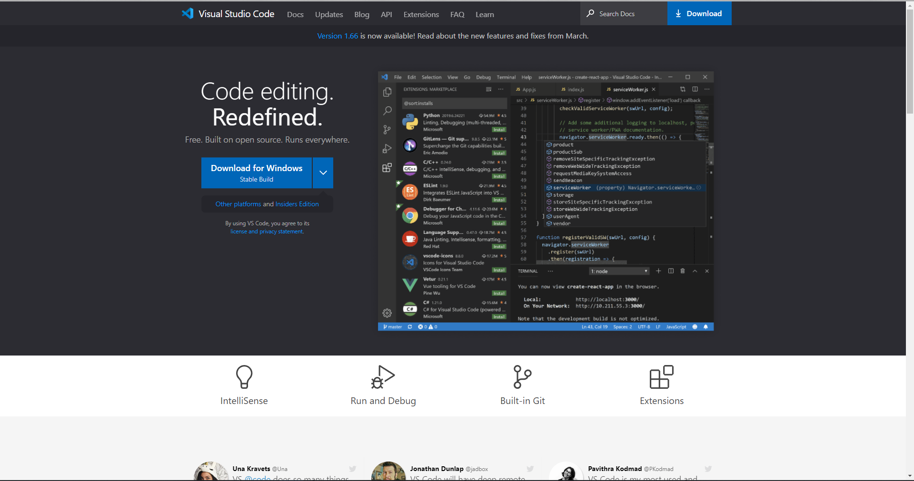
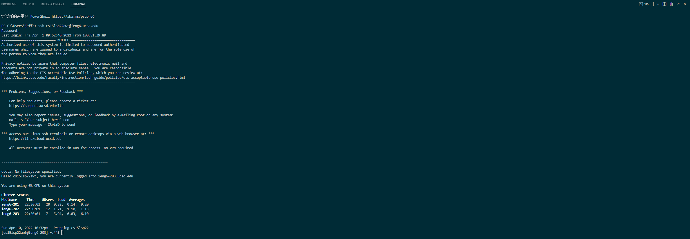
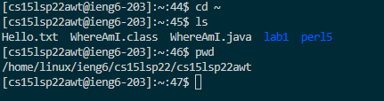
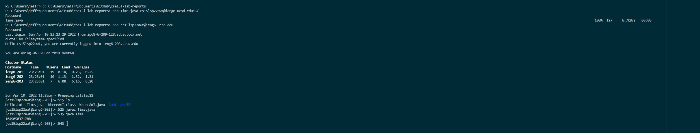
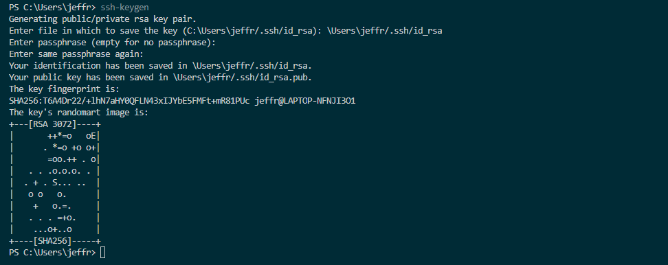
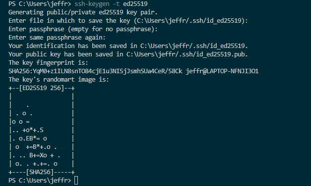
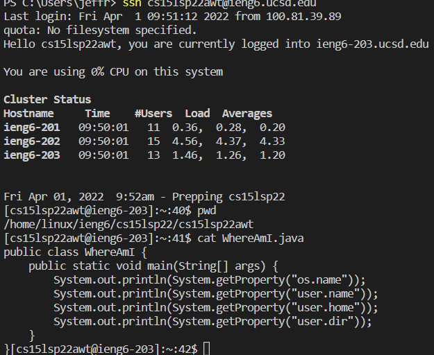

# ieng6 Tutorial
> Author: Jeffrey Li
## Installing VSCode
1. First download VSCoode from [VSCode website](https://code.visualstudio.com/).
2. Make sure that the correct version is downloaded and then follow the installation instructions

## Remotely Connecting
3. Open a new Terminal in VSCode using the Terminal - New Terminal option. \
4. Next, in the termianl, enter `ssh yourcouseaccount@ieng6.ucsd.edu` and then enter your password.\
For security purposes, your password would not be visible but it is still recorded.\
This is what you should see, make sure to type yes when asked if you want to continue connecting.

## Trying Some Commands
5. Try running some commands such as `cd, ls, pwd, mkdir, cp` in your terminal. \
Use Ctrl-D or the command exit to log off ieng6. \

## Moving Files with `scp`
6. One can move files from the client to the server with the `scp` command. \
First create the file that you want to mvoe. \
Then enter the command `scp fileName youraccount@ieng6.ucsd.edu`
You would then asked to enter your password, and afterwards, you should see the file by using `ls`.

## Setting an SSH key
7. On your client, run the command `ssh-keygen` and follow its steps. \
Make Sure to not add a passphrase.
 \
If you are using Windows, follow the extra steps below. \

8. Next, log into ieng6 using your account and use the `mkdir` command to make a directory called .ssh. \
Then use the `scp` command to copy your /Users/<user-name>/.ssh/id_rsa.pub file into your folder cs15lsp22zz@ieng6.ucsd.edu:~/.ssh/authorized_keys 
## Making Remote Running more Pleasent
9. You can include multiple commands when using ssh thereby making it a faster expernience. \
Seperate these commands with `;`. \

